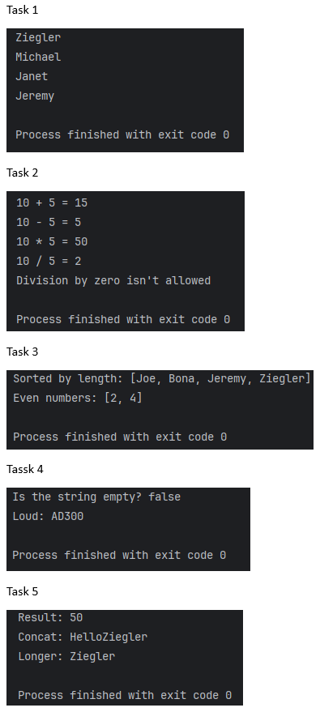

Introduction to Lambda Expressions in Java

This project demonstrates the use of Lambda Expressions in Java through various tasks. Each task is implemented in a separate Java file and covers different aspects of Lambda Expressions.

Screenshots:

Project Structure

The project contains the following Java files:

1. Task1.java - Understanding Lambda Expressions

Demonstrates the use of Lambda Expressions with a Runnable interface.

Prints a list of names in a separate thread using a lambda function.

2. Task2.java - Using Lambda Expressions with Functional Interfaces

Introduces a custom functional interface MathOperation.

Implements basic arithmetic operations (add, subtract, multiply, divide) using lambda expressions.

Prevents division by zero by handling the exception properly.

3. Task3.java - Using Lambda Expressions with Collections

Demonstrates sorting a list of names by length using a lambda comparator.

Filters even numbers from a list using Java Streams and Lambda expressions.

4. Task4.java - Using Built-in Functional Interfaces

Demonstrates the use of Predicate to check if a string is empty.

Uses Function to convert a string to uppercase.

5. Task5.java - Advanced Usage of Lambda Expressions

Demonstrates function composition using Function.andThen().

Implements a custom functional interface StringOperation to concatenate strings and determine the longer string.
## How to run the program
- Clone the repository
- run each java files (task1.java ...)